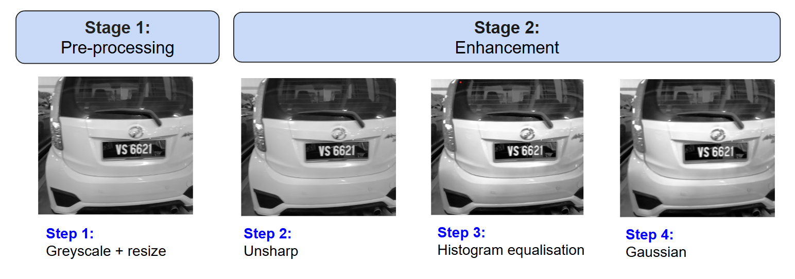
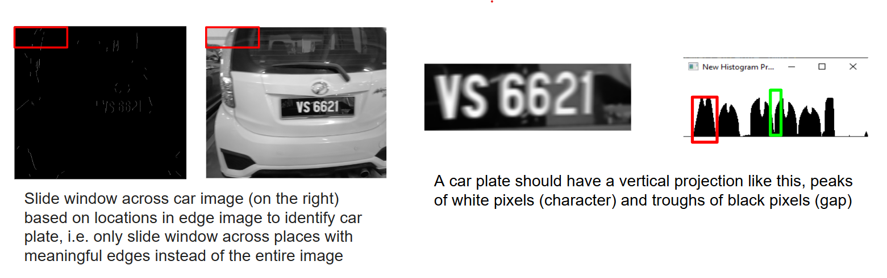

# A model trained to recognise car plates
In this project, we propose an algorithm to detect car plates, along with training a neural network model to recognise the detect car plate values. The steps are detailed below: 

## Locating the car plate 
### 1. Preprocessing 
Preprocessing steps are unsharp, histogram equalisation, and Gaussian blurring. 

### 2. Vertical Edge Detection
Vertical Sobel is applied to detect vertical edges. 

### 3. Edge Filtering
We remove edge noises. Any vertical edges longer than the estimated car plate height will be removed and vertical edges that are too short to be used to identify the car plate will be removed too.

### 4. Car plate location
We estimate 3 window sizes that approximate possible car plate sizes to slide across the preprocessed car image to locate the car plate. We leverage the colours of a common Malaysian car plate for car plate detection. A Malaysian car plate has white characters and a black background. Leveraging this information, we slide the windows across the car image and look for candidates that have similar patterns. For each window, we count the number of white pixels for each column to get the vertical projection histogram. A car plate should have a vertical projection similar to the image shown below, with peaks indicating the characters (a lot of white pixels) and troughs indicating the gaps (lack of white pixels). 

## Segment the located car plate 
Using the same idea as Step 3 above. We segment the carplate into its corresponding characters based on the vertical projection graph. 

## Identify the characters
A neural network is implemented from scratch and trained on images of characters to recognise the each character of the car plate. 
